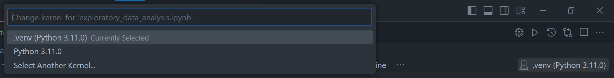

# Exploratory-Data-Analysis
Laboratory 5 of CPE232 - DATA MODELS

## Prepare Virtual Environment
You can use anaconda, env or virtualenv instead of poetry.

### Install poetry
```
pip install poetry
```
for make .venv in the project file (to make it easy to use in VScode)
```
poetry config virtualenvs.in-project true
```

### Install requirement library
```
poetry install
```

### Change kernal


